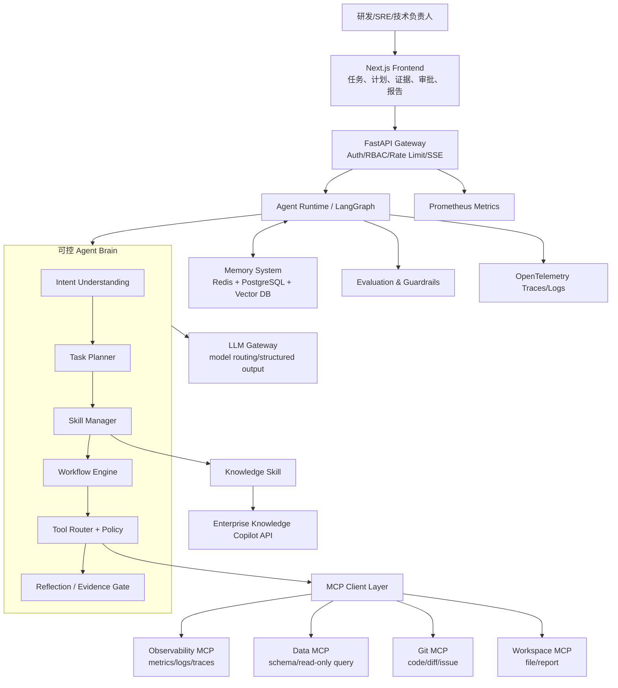
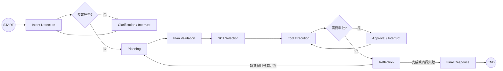
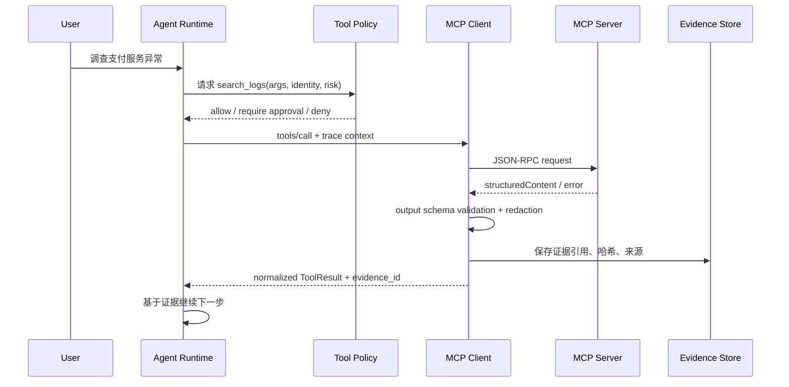
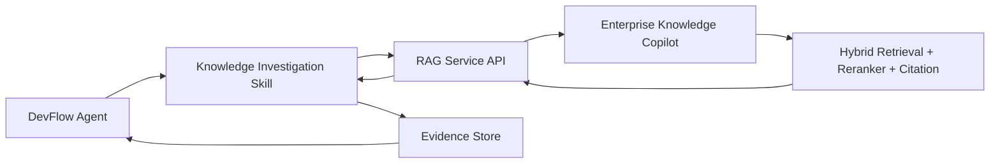

# DevFlow Agent：Enterprise AI Agent Platform 项目总设计

> 定位：企业研发故障调查与变更协同 Agent 平台  
> 核心命题：AI 如何利用企业知识和工具，可靠地完成复杂任务？

## 0. 设计结论

四个候选方向中，最适合作为第二个求职项目的是 **企业研发助手**，但不做宽泛的“代码聊天助手”，而是收敛为可验收的 B 端场景：

**DevFlow Agent：研发故障调查与变更协同平台。**

它接收告警、自然语言或错误截图，自动收集指标、日志、历史故障文档和代码变更证据，形成根因假设与处置建议，生成复盘报告，并在人工审批后创建整改 Issue。

选择理由：

- 企业价值明确：减少跨监控、日志、知识库、Git 和项目管理系统之间的人工切换，缩短 MTTR 和复盘准备时间。
- 与第一个 RAG 项目互补：Knowledge Copilot 是知识能力，DevFlow Agent 是执行与治理能力。
- 技术点自然出现：规划、Skill、MCP、工具调用、状态持久化、人工审批、审计和评测都是业务必需，而非堆栈展示。
- 面试追问空间大：每个模块都有明确输入、输出、失败模式、权衡和验收指标。

## 1. 项目核心定位

### 1.1 项目名称

中文名：**DevFlow 企业研发任务执行 Agent**  
英文名：**DevFlow Agent — Enterprise Incident Investigation & Change Coordination Platform**

### 1.2 项目背景

线上异常调查通常要求研发人员在监控平台、日志系统、数据仓库、Git、历史故障知识库和项目管理工具之间反复切换。真正困难的不是“回答一个问题”，而是确定调查范围、按依赖关系收集证据、处理失败、比较多种根因假设，并将结论转化为报告和后续行动。

普通工作流适合输入、步骤和分支稳定的任务；故障调查的下一步却取决于中间证据，存在不确定性。因此平台采用“固定治理骨架 + LLM 有界规划 + 确定性工具执行”。

### 1.3 企业痛点

| 痛点 | 现状 | Agent 价值 | 可量化指标 |
|---|---|---|---|
| 信息分散 | 人工切换 5–8 个系统 | 统一编排跨系统调查 | 平均系统切换次数、证据收集耗时 |
| 调查依赖个人经验 | 新人不清楚先看什么 | Skill 固化资深工程师 SOP | 首次计划通过率、遗漏证据率 |
| 报告准备重复 | 手工截图、复制时间线 | 自动生成带来源的复盘草稿 | 报告准备耗时、引用覆盖率 |
| 自动化有风险 | AI 可能误写文件或创建任务 | 权限分级、审批、幂等和审计 | 未授权写操作数、重复写入数 |
| 过程不可复现 | 只看到最终回答 | 状态检查点与全链路 Trace | 可恢复率、步骤级可观测覆盖率 |

注意：上述是评测指标，不在未实测前承诺具体提升百分比。

### 1.4 用户角色

- 一线研发工程师：快速收集证据、形成排查路径。
- SRE/值班工程师：在告警期间执行标准调查并保留审计记录。
- 技术负责人：审批高影响动作，审核根因与整改计划。
- 研发效能管理员：配置 Skill、工具权限、模型路由、预算和评测集。
- 安全/审计人员：查看谁在何时基于什么证据调用了什么工具。

### 1.5 典型使用案例

#### 案例 A：月度异常分析与复盘

用户：“分析最近一个月支付服务异常，结合历史故障和代码变更生成复盘报告，经我确认后创建整改 Issue。”

执行链：澄清服务与时间范围 → 查询指标/日志 → 检测异常 → 调用知识服务获取历史案例 → 关联 Git 变更 → 生成根因假设和图表 → 证据校验 → 生成报告 → 人工审批 → 创建 Issue。

#### 案例 B：Redis 连接失败调查

用户：“帮我解决 Redis 连接失败问题。”

Agent 先确认环境和影响范围，再调用 Knowledge Skill 获取历史 Bug 与 Runbook，读取相关服务日志和近期配置变更，运行只读代码搜索，输出按证据强弱排序的假设及验证命令；不直接修改生产配置。

#### 案例 C：错误截图辅助排查

用户上传监控或日志截图。视觉模型只负责结构化提取错误码、时间、服务名和关键日志片段；提取结果经用户可见确认后，进入与文本请求相同的调查工作流。

### 1.6 明确不做

- 不做无边界 ChatGPT 克隆。
- 不让模型直接执行任意 Shell、任意 SQL 或生产变更。
- 不把所有企业知识复制进本项目；复用 Knowledge Copilot API。
- MVP 不做多 Agent 群聊、自主长周期运行、自动修复生产环境。
- 不用“LLM 自评通过”替代规则校验、真实工具结果或人工审批。

## 2. 整体系统架构



### 2.1 模块职责

| 模块 | 职责 | 关键输入 | 关键输出 | 不能负责的事 |
|---|---|---|---|---|
| Frontend | 提交任务、展示计划/证据/进度、处理审批 | 用户请求、附件、审批决定 | task_id、反馈、可视化结果 | 不在浏览器保存企业密钥 |
| API Gateway | 身份认证、租户隔离、限流、流式事件 | HTTP/SSE 请求、JWT | 规范化请求、事件流 | 不做 Agent 推理 |
| Intent Understanding | 分类意图、抽取实体、识别风险与缺失参数 | 用户文本、附件摘要 | `IntentResult` | 不执行工具 |
| Task Planner | 产生有依赖的计划和成功标准 | 意图、可用 Skill 摘要、策略 | `TaskPlan` | 不直接调用外部系统 |
| Workflow Engine | 调度节点、分支、重试、暂停、恢复、补偿 | AgentState、TaskPlan | 步骤状态、检查点 | 不把任意模型文本当指令执行 |
| Skill Manager | 发现、匹配、加载、版本化可复用工作流包 | Skill 元数据、意图 | 选中 Skill 与完整指令 | Skill 不是一次原子 API 调用 |
| Tool Router | 选择工具、校验参数、执行权限策略、归一化结果 | ToolRequest、用户权限 | ToolResult、审计事件 | 不允许模型绕过策略层 |
| Memory System | 保存任务状态、会话上下文、偏好和历史任务摘要 | state、memory write candidate | 检索结果、检查点 | 不把全部聊天永久保存 |
| MCP Layer | 标准化发现与调用外部能力，隔离连接细节 | MCP tool name/args | 结构化 MCP 结果 | MCP 不等于业务 Skill |
| LLM Gateway | 模型路由、超时、重试、缓存、结构化输出 | prompt、schema、budget | validated output | 不持有业务写权限 |
| Evaluation | 离线用例、在线质量、安全与性能度量 | trace、结果、标注 | 分数、回归报告、告警 | 不只看“回答像不像” |

### 2.2 一次请求的数据流

1. Gateway 根据用户身份构造 `ExecutionContext`，不信任前端传来的角色字段。
2. Intent 节点抽取 `service=payment`、`time_range=30d`、`deliverable=postmortem`、`requested_action=create_issue`。
3. Planner 只看到通过权限过滤后的 Skill 摘要，生成依赖明确的结构化计划。
4. Workflow Engine 逐步执行；每个步骤只加载需要的 Skill 和 Tool Schema。
5. Tool Router 在调用前执行参数校验、资源范围校验、风险分级和预算检查。
6. 只读工具可自动执行；写报告到任务沙箱属于低风险写入；创建 Issue 需要审批；生产变更在 MVP 中禁止。
7. 每个工具结果写入 Evidence Store，并生成 `source_uri`、时间、哈希和 trace_id。
8. Reflection 只做“计划/证据/结果”校验；若缺证据，最多触发有界重规划，不允许无限循环。
9. Final Response 引用真实 Evidence ID，展示结论、置信度、未验证项和已执行动作。

## 3. Agent 核心设计：可控 Agent Workflow

### 3.1 为什么企业更需要可控 Agent

完全自由 Agent 的问题不是模型“不够聪明”，而是执行边界不明确：它可能改变计划、重复写入、扩张数据范围、消耗失控，且失败后难以恢复。企业任务需要五种确定性：权限确定、状态可恢复、副作用可控制、证据可追溯、成本可约束。

因此采用两层结构：

- 确定性控制面：状态机、权限、审批、预算、重试、幂等、审计。
- 概率性决策面：意图理解、计划候选、Skill/Tool 候选排序、总结与根因假设。

### 3.2 AgentState

```python
from typing import Any, Literal, TypedDict

class Evidence(TypedDict):
    evidence_id: str
    source_type: Literal["metric", "log", "trace", "git", "knowledge", "file"]
    source_uri: str
    collected_at: str
    content_hash: str
    summary: str
    raw_ref: str

class PlanStep(TypedDict):
    step_id: str
    title: str
    skill: str
    depends_on: list[str]
    status: Literal["pending", "running", "succeeded", "failed", "blocked", "skipped"]
    success_criteria: list[str]
    risk_level: Literal["read", "low_write", "high_write", "prohibited"]
    retry_count: int

class AgentState(TypedDict):
    task_id: str
    tenant_id: str
    user_id: str
    user_roles: list[str]
    request: str
    attachments: list[dict[str, Any]]
    intent: dict[str, Any]
    plan: list[PlanStep]
    current_step_id: str | None
    selected_skills: list[str]
    tool_results: list[dict[str, Any]]
    evidence: list[Evidence]
    hypotheses: list[dict[str, Any]]
    approval: dict[str, Any] | None
    memory_refs: list[str]
    errors: list[dict[str, Any]]
    budget: dict[str, int | float]
    final_answer: str | None
```

设计约束：State 保存原始或结构化事实，不保存只为展示而拼接的大段文本；密钥永不进入 State；敏感工具结果只存受控引用；所有可恢复字段必须可序列化。

### 3.3 节点与输入输出



| 节点 | 输入 | 输出 | 失败处理 |
|---|---|---|---|
| Intent Detection | request、附件提取、用户上下文 | 意图、实体、风险、缺失参数 | 低置信度时询问用户，不猜生产范围 |
| Planning | 意图、Skill 摘要、策略、预算 | 符合 Schema 的 TaskPlan | Schema 失败修复 1 次，再返回可解释错误 |
| Plan Validation | TaskPlan、权限、工具目录 | validated plan | 检查 DAG、步骤上限、写操作审批、成功标准 |
| Skill Selection | step、Skill 元数据 | skill_id/version、候选分数 | 无合适 Skill 时走受限通用只读路径或阻塞 |
| Tool Execution | step、Skill 指令、Tool Schema | 结构化结果、Evidence、审计 | 超时重试仅用于可重放读操作；写操作用幂等键 |
| Approval | 动作预览、参数、影响范围 | approve/edit/reject | 长期暂停并保存检查点；拒绝原因回写 State |
| Reflection | 计划、证据、结果、验收条件 | pass/replan/fail、缺口 | 最多 2 次重规划，不能仅凭模型说“完成” |
| Final Response | 验证后的状态 | 结论、引用、动作、限制 | 无证据的结论标注“假设”，不伪造引用 |

### 3.4 受控循环与终止条件

- `max_plan_steps=8`、`max_replans=2`、单工具 `max_retries=2`。
- 为模型 token、工具次数、任务时长分别设预算。
- 只读且幂等的瞬时失败才自动重试；权限错误、业务校验错误不重试。
- 写操作使用 `idempotency_key = task_id + step_id + normalized_args_hash`。
- 任一 `prohibited` 动作直接拒绝；高风险生产变更不提供对应 Tool。
- 达到预算或证据不足时，输出部分结果、已完成步骤和下一步人工建议。

## 4. Task Planning 设计

### 4.1 Planner 的职责边界

Planner 负责“做什么、依赖什么、如何验收”，不负责生成可直接执行的 SQL、Shell 或写操作参数。具体参数在步骤执行时由 Skill 和 Tool Schema 共同约束，避免一次规划把危险细节埋入自由文本。

### 4.2 Planner Prompt 核心

```text
你是企业研发任务规划器。根据已解析意图、允许使用的 Skill 摘要和执行策略，
生成最小充分计划。每一步必须绑定一个 Skill、显式依赖、成功标准和风险等级。

规则：
1. 只使用 ALLOWED_SKILLS 中存在的 skill_id。
2. 计划不超过 8 步；无依赖的只读步骤可并行。
3. 写操作必须放在证据验证之后，并标记 requires_approval=true。
4. 不生成 SQL、Shell、密钥、URL 或虚构工具结果。
5. 如果关键范围缺失，返回 status=needs_clarification 和问题，不得猜测。
6. 最终产物必须说明需要哪些证据才能验收。
仅返回符合 TaskPlan JSON Schema 的 JSON。
```

### 4.3 TaskPlan JSON Schema（节选）

```json
{
  "$schema": "https://json-schema.org/draft/2020-12/schema",
  "title": "TaskPlan",
  "type": "object",
  "additionalProperties": false,
  "required": ["status", "goal", "steps", "completion_criteria"],
  "properties": {
    "status": {"enum": ["ready", "needs_clarification", "rejected"]},
    "goal": {"type": "string", "minLength": 1, "maxLength": 300},
    "clarification_questions": {
      "type": "array", "maxItems": 3, "items": {"type": "string"}
    },
    "steps": {
      "type": "array", "minItems": 1, "maxItems": 8,
      "items": {
        "type": "object", "additionalProperties": false,
        "required": ["step_id", "title", "skill_id", "depends_on", "success_criteria", "risk_level", "requires_approval"],
        "properties": {
          "step_id": {"type": "string", "pattern": "^S[1-8]$"},
          "title": {"type": "string", "maxLength": 120},
          "skill_id": {"type": "string"},
          "depends_on": {"type": "array", "items": {"type": "string"}},
          "success_criteria": {"type": "array", "minItems": 1, "items": {"type": "string"}},
          "risk_level": {"enum": ["read", "low_write", "high_write", "prohibited"]},
          "requires_approval": {"type": "boolean"}
        }
      }
    },
    "completion_criteria": {"type": "array", "minItems": 1, "items": {"type": "string"}}
  }
}
```

### 4.4 示例计划

```json
{
  "status": "ready",
  "goal": "调查支付服务最近 30 天异常并生成复盘及整改任务",
  "clarification_questions": [],
  "steps": [
    {"step_id":"S1","title":"读取服务指标与异常窗口","skill_id":"incident_data_analysis","depends_on":[],"success_criteria":["获得完整时间范围和异常点"],"risk_level":"read","requires_approval":false},
    {"step_id":"S2","title":"检索日志和 Trace 证据","skill_id":"incident_evidence_collection","depends_on":["S1"],"success_criteria":["每个主要异常至少关联一个日志或 Trace 证据"],"risk_level":"read","requires_approval":false},
    {"step_id":"S3","title":"检索历史故障与 Runbook","skill_id":"knowledge_investigation","depends_on":["S1"],"success_criteria":["返回可引用的历史案例或明确无匹配"],"risk_level":"read","requires_approval":false},
    {"step_id":"S4","title":"关联近期代码与配置变更","skill_id":"change_correlation","depends_on":["S1"],"success_criteria":["列出变更时间、作者、文件和差异引用"],"risk_level":"read","requires_approval":false},
    {"step_id":"S5","title":"形成并验证根因假设","skill_id":"incident_reasoning","depends_on":["S2","S3","S4"],"success_criteria":["假设与反证均绑定 Evidence ID"],"risk_level":"read","requires_approval":false},
    {"step_id":"S6","title":"生成图表与复盘报告","skill_id":"postmortem_generation","depends_on":["S5"],"success_criteria":["报告包含时间线、影响、根因、证据和整改项"],"risk_level":"low_write","requires_approval":false},
    {"step_id":"S7","title":"创建整改 Issue","skill_id":"issue_coordination","depends_on":["S6"],"success_criteria":["Issue 链接写回任务记录且无重复创建"],"risk_level":"high_write","requires_approval":true}
  ],
  "completion_criteria": ["报告引用覆盖所有关键结论", "用户已审批对外写操作"]
}
```

### 4.5 计划校验器

在 LLM 之后运行确定性校验：Schema 校验、DAG 无环、依赖存在、Skill 可用、权限覆盖、风险与审批一致、最大步骤和预算未超限、最终交付物可达。计划通过后才写入检查点。

## 5. Skill 系统设计

### 5.1 Skill 与 Tool 的区别

| 维度 | Skill | Tool |
|---|---|---|
| 定义 | 可复用业务工作流包，包含方法、约束、模板和工具依赖 | 单一、可调用、可验证的原子能力 |
| 粒度 | “完成故障证据收集” | `search_logs` |
| 是否含 Prompt | 是 | 通常只有描述和参数 Schema |
| 是否可编排多个工具 | 是 | 否 |
| 是否有验收标准 | 有 | 只有调用成功/失败与输出 Schema |
| 版本治理 | 业务语义版本、评测集、兼容性 | API/Schema 版本、权限策略 |

一句面试答案：**Tool 决定“能做什么动作”，Skill 固化“在什么场景下按什么步骤、约束和质量标准组合这些动作”。**

### 5.2 目录结构

官方 Skill 的核心思想是渐进式披露：先加载名称和描述，匹配后再读取完整指令与资源。本项目兼容该思想，同时增加企业治理元数据。

```text
skills/
├─ incident_evidence_collection/
│  ├─ SKILL.md                  # 主指令；便于 Agent Skills 兼容
│  ├─ skill.yaml                # 企业注册、权限、版本和 I/O Schema
│  ├─ prompt.md                 # 可独立评测的提示词模板
│  ├─ tools/
│  │  └─ bindings.yaml          # 允许的工具与最小权限
│  ├─ config/
│  │  ├─ policy.yaml            # 超时、重试、审批、预算
│  │  └─ output.schema.json
│  ├─ references/               # Runbook、字段说明，按需加载
│  ├─ templates/                # 输出模板
│  └─ tests/
│     ├─ cases.yaml
│     └─ expected.json
├─ incident_data_analysis/
├─ knowledge_investigation/
├─ change_correlation/
├─ postmortem_generation/
└─ issue_coordination/
```

### 5.3 `skill.yaml` 示例

```yaml
apiVersion: devflow.ai/v1
kind: Skill
metadata:
  id: incident_evidence_collection
  name: Incident Evidence Collection
  version: 1.2.0
  owner: sre-platform
  tags: [incident, logs, metrics, traces]
spec:
  description: >
    Collects read-only metrics, logs and traces for a bounded service and time range;
    use for incident investigation, not for changing monitoring or production systems.
  trigger_examples:
    - 调查支付服务昨晚错误率上升
    - 收集该告警对应的日志和 Trace
  input_schema: config/input.schema.json
  output_schema: config/output.schema.json
  prompt: prompt.md
  allowed_tools:
    - observability.query_metrics
    - observability.search_logs
    - observability.get_trace
  required_permissions: [observability:read]
  risk_level: read
  budgets:
    max_tool_calls: 8
    timeout_seconds: 90
  quality_gates:
    - every_finding_has_evidence_id
    - time_range_is_bounded
```

### 5.4 Skill 发现、选择与加载

1. 启动时 Registry 扫描并校验 `skill.yaml`，只把 `id/name/version/description/tags/risk/permissions` 建索引。
2. 先按租户、角色、风险和依赖健康度做硬过滤。
3. 再用关键词/BM25 + embedding 召回 top-k；对少量候选用 LLM 结构化重排。
4. 选择结果必须包含 `skill_id`、版本、理由、所需权限和置信度。
5. 只有选中后才加载 `SKILL.md/prompt.md/references`，防止上下文膨胀和无关指令污染。
6. Tool Router 仍会独立校验每次调用；Skill 声明工具不等于自动获得权限。

### 5.5 Skill 扩展与治理

- 新 Skill 通过 manifest/schema 校验、权限审查、离线用例、Prompt Injection 用例和回归评测后注册。
- 使用语义化版本；破坏性 I/O 变更升 major；运行中的任务固定版本，不热切换。
- 支持 tenant allowlist、灰度发布、回滚和 deprecated 状态。
- Skill 输出必须符合 Schema；自由文本仅作为展示字段，关键字段可机器校验。
- 禁止 Skill 自行下载代码、扩大 Tool 列表或读取未声明密钥。

## 6. MCP 协议设计

### 6.1 为什么企业 Agent 需要 MCP

Function Calling 解决“模型如何请求一个函数”，MCP 解决“不同宿主如何用统一协议发现、连接和调用外部能力与上下文”。它将 Agent Runtime 与 Git、监控、数据平台等具体 SDK 解耦，便于替换供应商、独立部署、统一授权与审计。

MCP 不是安全边界本身：服务器返回的工具描述和注解仍应视为不可信元数据；宿主必须执行自己的身份、授权、参数与审批策略。

### 6.2 MCP Client

职责：连接生命周期、能力协商、`tools/list` 缓存与变更通知、`tools/call`、超时/取消、结果 Schema 校验、错误归一化、trace context 传播、OAuth/Bearer 或服务身份处理。

部署策略：本地开发用 STDIO；企业集成用 Streamable HTTP。每个服务使用独立 service account 和最小 scope，不把用户 token 直接暴露给模型。

### 6.3 四个 MCP Server

#### Observability MCP Server

| Tool | 用途 | 权限/限制 |
|---|---|---|
| `query_metrics` | 查询服务指标和时间序列 | 只读；强制 service/time_range；最大 30 天 |
| `search_logs` | 按服务、时间、级别、关键词检索日志 | 只读；脱敏；结果数上限 |
| `get_trace` | 获取指定 trace 的调用链摘要 | 只读；按租户校验 trace 所属 |

#### Data MCP Server

| Tool | 用途 | 权限/限制 |
|---|---|---|
| `get_schema` | 获取允许数据集的表与字段 | allowlist |
| `query_readonly` | 执行受限 SELECT | SQL AST 校验、超时、行数限制、只读副本 |
| `aggregate_metric` | 按受控维度聚合业务指标 | 参数化查询，不让模型拼 SQL |

#### Git MCP Server

| Tool | 用途 | 权限/限制 |
|---|---|---|
| `search_code` | 搜索代码和配置引用 | 只读、仓库 allowlist |
| `get_diff` | 读取 commit/PR 差异 | 只读、文件大小限制 |
| `list_commits` | 按时间和路径查询变更 | 只读 |
| `create_issue` | 创建整改 Issue | 人工审批、幂等键、字段模板 |

#### Workspace MCP Server

| Tool | 用途 | 权限/限制 |
|---|---|---|
| `read_file` | 读取任务沙箱中的附件/模板 | 路径规范化、根目录限制 |
| `write_report` | 写入复盘草稿 | 仅任务目录、原子写入、版本化 |
| `render_chart` | 从结构化数据生成图表 | 无网络、资源限额 |

Knowledge Copilot 保持独立的 RAG Service API，由 Knowledge Skill 调用；后续若多宿主复用需求成立，再增加 Knowledge MCP Adapter，避免 MVP 为协议而协议。

### 6.4 Tool Schema 示例

```json
{
  "name": "observability.search_logs",
  "title": "Search bounded service logs",
  "description": "Search redacted logs for one allowed service in a bounded time range. Read-only; never changes log configuration.",
  "inputSchema": {
    "$schema": "https://json-schema.org/draft/2020-12/schema",
    "type": "object",
    "additionalProperties": false,
    "required": ["service", "start_time", "end_time", "query"],
    "properties": {
      "service": {"type": "string", "pattern": "^[a-z0-9-]{2,64}$"},
      "start_time": {"type": "string", "format": "date-time"},
      "end_time": {"type": "string", "format": "date-time"},
      "query": {"type": "string", "minLength": 1, "maxLength": 500},
      "limit": {"type": "integer", "minimum": 1, "maximum": 200, "default": 50}
    }
  },
  "outputSchema": {
    "type": "object",
    "additionalProperties": false,
    "required": ["events", "truncated", "source_uri"],
    "properties": {
      "events": {"type": "array", "items": {"type": "object"}},
      "truncated": {"type": "boolean"},
      "source_uri": {"type": "string"}
    }
  },
  "annotations": {"readOnlyHint": true, "destructiveHint": false, "idempotentHint": true}
}
```

### 6.5 调用流程



## 7. Function Calling 与 Tool 系统

### 7.1 工具分类

- Internal Tool：OCR 后处理、异常检测、图表渲染、报告模板填充；运行在受限进程/沙箱。
- External API Tool：非企业核心的第三方服务；MVP 仅在业务确有需要时接入。
- Enterprise Tool：监控、数据库、Git、知识服务、项目管理；通过 MCP 或受控 Adapter 接入。

### 7.2 LLM 如何选择 Tool

1. Planner 先选择 Skill，缩小工具命名空间。
2. Registry 根据权限、租户、环境和健康状态过滤不可用工具。
3. 模型只看到 top-k 工具的精确描述、输入 Schema、风险提示。
4. 模型产生结构化 `ToolRequest`；Pydantic/JSON Schema 校验参数。
5. Policy Engine 根据 RBAC/ABAC、风险等级、资源范围和审批状态做最终决策。
6. 工具执行后验证 outputSchema，失败类型化为 retryable、user_fixable、policy_denied 或 fatal。

模型的工具选择是候选决策，不是授权决定。

### 7.3 写操作防护

- 展示目标系统、动作、关键参数、影响范围和证据摘要后再审批。
- 审批绑定 task_id、step_id、参数哈希、有效期；参数变化后原审批失效。
- 写工具必须支持幂等键；结果记录外部资源 ID。
- 不对未知执行结果盲目重试：先按幂等键查询或进入人工确认。
- MVP 不暴露删除、合并、部署、修改生产配置等高影响工具。

## 8. Memory 系统

### 8.1 三类数据不要混淆

| 类型 | 内容 | 存储 | 生命周期 |
|---|---|---|---|
| Working/Short Memory | 当前 AgentState、计划、步骤结果、审批 | Redis 热状态 + PostgreSQL Checkpoint | 任务期，完成后归档 |
| Episodic Long Memory | 历史任务摘要、用户反馈、已确认偏好 | PostgreSQL + Vector Index | 按企业保留策略 |
| Enterprise Knowledge | Runbook、故障文档、规范 | 现有 Knowledge Copilot | 由项目 1 管理 |

SQLite 只用于本地 MVP；生产使用 PostgreSQL。Redis 用于锁、短期缓存、事件流和热状态，不能作为唯一持久化来源。

### 8.2 什么时候读取 Memory

- Intent 前：读取租户策略和用户明确确认的展示偏好，不注入无关历史。
- Planning 前：检索相同服务、相似任务和用户反馈摘要；所有历史结果标注时间与状态。
- Tool 前：读取当前检查点、审批和幂等记录，防止重复副作用。
- Final 前：读取交付格式偏好，但不得用偏好覆盖安全策略。

### 8.3 什么时候写入 Memory

- 每个节点成功后写检查点。
- 任务结束后只写结构化摘要、结果引用和用户反馈，不默认保存原始敏感日志。
- 用户偏好仅在明确表达且稳定时写入；模型推测不能成为长期偏好。
- 企业知识更新仍走 Knowledge Copilot 的审核与摄取流程。

### 8.4 隔离与删除

所有键都包含 tenant_id；数据库启用行级访问控制；向量检索先做 ACL 过滤；敏感字段加密；设 TTL/保留策略；支持按用户/任务删除；Memory 读取结果也视为不可信上下文，防止持久化 Prompt Injection。

## 9. 多模态能力

### 9.1 真实场景

研发人员经常只拿到群聊里的错误截图或监控截图。让用户手工转录错误码、时间、曲线异常点既慢又易错，因此加入视觉输入是业务所需。

处理链：附件杀毒与格式校验 → OCR/视觉结构化提取 → 输出 `service/time/error_code/log_snippet/chart_anomaly` → 用户可见确认 → 文本调查工作流。

### 9.2 模型选择

通过 `VisionProvider` 抽象接入 Qwen-VL、OpenAI Vision 或 Claude Vision，按数据驻留、成本、延迟和准确率选择，不在业务代码中绑定具体模型名。模型只返回结构化观察，不直接给生产处置指令。

### 9.3 评测与降级

- 使用脱敏截图集评测字段准确率、关键错误召回率和幻觉率。
- OCR/视觉低置信度字段高亮给用户确认。
- 无视觉模型时允许用户粘贴文本；多模态失败不阻塞核心文本工作流。

## 10. 与 Enterprise Knowledge Copilot 结合



Knowledge Skill 的响应契约：

```json
{
  "query_id": "q_123",
  "answer": "历史案例摘要",
  "evidence": [
    {
      "document_id": "inc_2025_017",
      "chunk_id": "c_8",
      "title": "Redis 连接池耗尽复盘",
      "quote": "受版权和数据策略约束的短证据片段",
      "source_uri": "knowledge://inc_2025_017#c_8",
      "score": 0.87
    }
  ],
  "retrieval_version": "2026-08-01"
}
```

边界：

- Knowledge Copilot 对文档摄取、召回、重排和引用正确性负责。
- Knowledge Skill 对查询构造、ACL 传递、结果结构化和 Evidence 转换负责。
- Agent 对何时需要知识、如何与实时数据/代码证据组合、是否采取行动负责。
- RAG 返回内容可能包含恶意指令；一律作为数据，不允许改变系统策略或直接触发工具。

Redis 案例执行：知识库获取历史 Bug → Observability MCP 获取当前日志 → Git MCP 读取相关连接池配置变更 → Agent 比对症状 → 输出验证顺序和方案；没有审批不修改配置。

## 11. 工程化设计

### 11.1 技术栈

- Backend：Python 3.12、FastAPI、Pydantic、LangGraph。
- Frontend：Next.js、React、TypeScript；SSE 展示步骤事件。
- Data：PostgreSQL（任务/检查点/审计）、Redis（锁/缓存/流）、现有 Vector DB（长期语义索引）。
- Integration：MCP Python SDK，STDIO/Streamable HTTP。
- Deployment：Docker Compose 开发；生产可迁移 Kubernetes，但 MVP 不为“云原生”而增加复杂度。
- Observability：OpenTelemetry Trace/Log，Prometheus 指标，结构化审计日志。

### 11.2 后端模块

```text
backend/
├─ api/                 # tasks, events, approvals, reports
├─ agent/
│  ├─ state.py
│  ├─ graph.py
│  ├─ nodes/
│  └─ policies/
├─ planner/             # prompts, schemas, validator
├─ skills/              # registry, matcher, loader, versions
├─ tools/               # router, schema, policy, idempotency
├─ mcp/                 # client pool, adapters, normalized errors
├─ memory/              # checkpoints, episodic memory, retention
├─ knowledge/           # Knowledge Copilot client
├─ evaluation/          # datasets, graders, regression runner
├─ observability/       # tracing, metrics, audit
└─ tests/               # unit, contract, workflow, security, eval
```

### 11.3 稳定性

- LangGraph Checkpoint 支持中断恢复；PostgreSQL 是持久化真源。
- 节点小而单一；外部副作用封装为幂等 Task；读重试采用指数退避和抖动。
- MCP 连接池有健康检查、熔断、并发/超时限制和按服务隔离的 bulkhead。
- 事件采用 outbox；外部写成功后即使响应丢失，也可通过幂等键对账。
- Graceful degradation：知识服务不可用时仍可做实时证据调查，并明确缺失来源。

### 11.4 可维护性

- Planner、Skill、Tool I/O 全部 Schema 化；接口做契约测试。
- Prompt、Skill、模型和评测集均版本化，Trace 记录具体版本。
- 策略代码与 Prompt 分离；权限由 Policy Engine 判定。
- Architecture Decision Record 记录为何选单 Agent、为何 RAG 外置、哪些动作禁止。

### 11.5 可扩展性

- Agent Runtime 与外部系统通过 MCP/Adapter 解耦。
- Skill Registry 支持插件式注册、租户 allowlist 和灰度版本。
- 无依赖只读步骤可受控并行；写步骤串行并带锁。
- LLM Gateway 可按任务路由模型，保留 fallback；不把模型专有字段扩散到业务层。

### 11.6 可观测性

Trace 层级：`task → node → model_call/tool_call → policy/approval`。每个 span 记录 task_id、tenant、版本、延迟、token/费用、结果状态；不记录密钥和原始敏感日志。

Prometheus 核心指标：

- `devflow_tasks_total{intent,status}`
- `devflow_task_duration_seconds{intent}`
- `devflow_tool_calls_total{server,tool,status}`
- `devflow_tool_duration_seconds{server,tool}`
- `devflow_approval_wait_seconds{action}`
- `devflow_plan_replans_total{reason}`
- `devflow_evidence_coverage_ratio{intent}`

禁止把 user_id、task_id、trace_id 作为 Prometheus label，避免高基数；这些字段放日志/Trace。

## 12. 安全、可靠性与评测

### 12.1 威胁模型与控制

| 风险 | 控制 |
|---|---|
| Prompt Injection | 外部内容标记为 data；系统指令隔离；工具参数策略独立；恶意样本评测 |
| 越权数据访问 | SSO、RBAC+ABAC、tenant filter、最小权限服务身份 |
| 危险写操作 | 默认只读、审批、参数哈希绑定、幂等、禁止工具不注册 |
| 数据泄露 | 日志脱敏、敏感 Trace 关闭、出站 allowlist、加密与保留策略 |
| SQL/路径注入 | 参数化查询、SQL AST allowlist、路径 canonicalization 与根目录限制 |
| 无限循环/费用失控 | 步骤、重规划、token、工具次数和总时长预算 |
| 幻觉结论 | Evidence Gate、引用存在性校验、假设与事实分栏 |
| 供应链风险 | Skill/MCP 签名、固定版本、依赖扫描、准入审核 |

### 12.2 Evidence Gate

关键结论必须至少满足：存在有效 Evidence ID；来源 URI 可访问；采集时间符合调查窗口；内容哈希一致；证据没有被错误步骤标记为失败；关键因果结论同时列出支持证据与可能反证。模型置信度只能作为辅助，不能替代这些检查。

### 12.3 离线评测

构造脱敏 Golden Set，覆盖正常、缺参数、工具超时、无权限、恶意日志、冲突证据、写操作拒绝、恢复执行等场景。

| 层次 | 指标 | 评测方法 |
|---|---|---|
| Intent | 分类准确率、实体 F1、澄清正确率 | 标注输入输出 |
| Planning | Schema 通过率、DAG 有效率、步骤召回/精确率 | 规则 + 专家标注 |
| Skill/Tool | top-1 选择准确率、参数准确率 | 固定 Registry 回放 |
| Execution | 任务完成率、恢复率、重复副作用数 | 故障注入与 replay |
| Answer | 证据覆盖率、引用正确率、未支持结论率 | 程序校验 + 双人复核 |
| Safety | 越权阻断率、危险操作阻断率、注入攻击成功率 | 红队用例 |
| System | p50/p95 时延、token/任务、工具错误率 | Trace 聚合 |

### 12.4 上线门槛与回归

- 关键安全用例必须 100% 阻断；任何未授权写操作都阻塞发布。
- Planner/Tool Schema 通过率和任务完成率设基线，任何版本不得显著回退。
- Prompt、模型、Skill、Tool Schema 任一变化都运行同一评测集。
- 线上采集用户接受/修改/拒绝、人工接管、失败原因；不把用户敏感内容默认回流训练。

## 13. 为什么不是普通 Workflow

如果步骤固定、数据源固定、错误分支可穷举，普通 Workflow 更便宜、更可靠，应该优先使用。DevFlow 需要 Agent，是因为异常类型、所需证据和下一步依赖中间观察，无法预先写完所有分支。

但本项目仍大量使用 Workflow：身份、预算、审批、重试、终止和写入顺序固定；只有意图、规划候选、工具候选和证据综合由模型参与。**Agent 与 Workflow 不是二选一；企业方案通常是 Workflow 管住 Agent。**

## 14. 从 Demo 到生产的判定标准

Demo 关注“能跑一次”；生产系统还必须回答：失败后从哪里恢复、重复调用是否产生副作用、谁有权限、敏感数据去了哪里、每个结论的证据是什么、版本变更是否回归、成本和延迟是否有上限、如何审计和回滚。

当项目具备持久化状态、权限与审批、幂等、全链路 Trace、离线评测、错误分级、租户隔离、数据治理和运行 SLO，才算开始从 Demo 走向生产。

## 15. 参考口径（2026-08 核对）

- [OpenAI Skills](https://developers.openai.com/codex/skills)：技能是包含指令、资源和可选脚本的可复用工作流包；运行时先匹配名称/描述，再加载完整内容，体现渐进式披露。
- [OpenAI MCP](https://developers.openai.com/codex/mcp)：MCP 用于把模型连接到第三方工具和上下文；本地可用 STDIO，远程可用 Streamable HTTP，并应配置认证和工具审批策略。
- [MCP Tool 规范](https://modelcontextprotocol.io/specification/2025-11-25/server/tools)：工具以名称、描述、inputSchema 和可选 outputSchema 描述；敏感调用应保留人工控制，工具注解不能被宿主无条件信任。
- [LangGraph Persistence](https://docs.langchain.com/oss/python/langgraph/persistence) 与 [Interrupts](https://docs.langchain.com/oss/python/langgraph/interrupts)：检查点支持暂停/恢复、Human-in-the-loop、故障恢复和时间旅行；副作用必须幂等。

这些参考只约束设计思想。本项目的企业 Skill manifest、Policy Engine 和审批模型是面向场景做的工程扩展，不宣称属于任何厂商协议标准。
