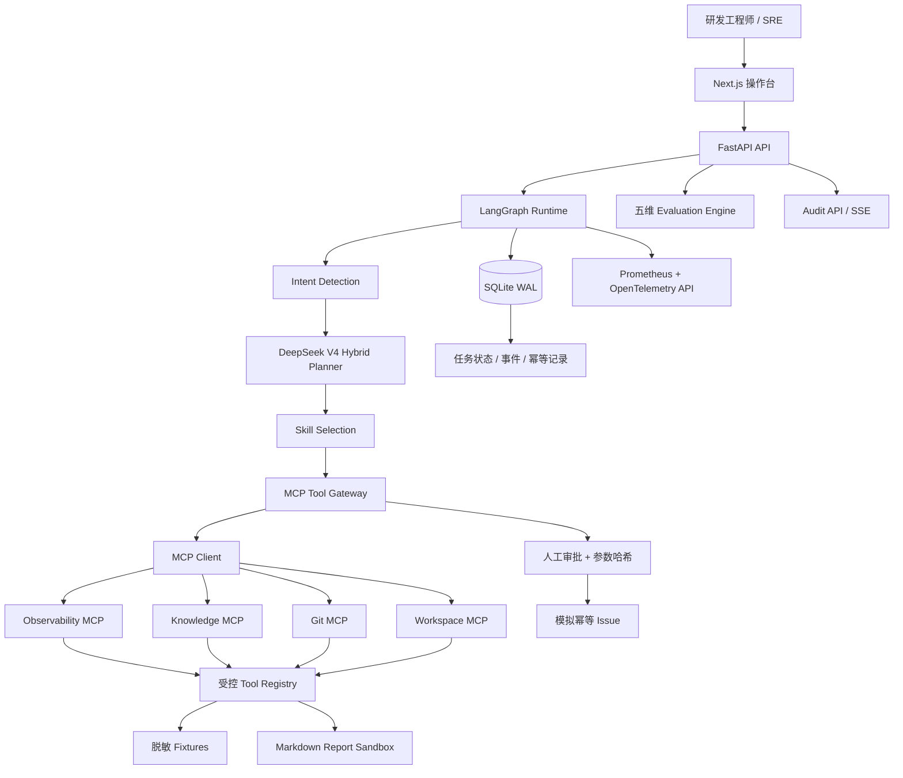
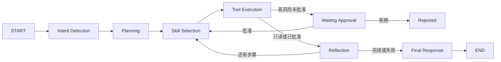

# DevFlow Agent 当前项目全景与验收报告

> 首次验收：2026-08-06；最新事实更新：2026-08-15  
> 验收对象：`F:\video\agentmcpskill`  
> 验收口径：同时区分“设计文档已覆盖”“本地 MVP 已实现”“生产化已实现”，避免用设计目标冒充代码成果。

## 1. 最终结论

### 1.1 按“求职核心 MVP”验收

**达标。**

当前项目已经不是聊天机器人、Function Calling 示例或 LangChain 教程，而是一个围绕研发故障调查的完整 B 端任务闭环：

1. 用户提交支付服务异常调查目标。
2. Agent 识别服务、时间范围和交付物。
3. Planner 生成 7 步结构化计划。
4. Runtime 调用指标、日志、知识、Git、推理和报告工具。
5. 所有结论生成 Evidence ID、来源 URI 和内容哈希。
6. 创建 Issue 前进入人工审批暂停。
7. 批准后校验角色与参数哈希，幂等创建模拟 Issue。
8. Evaluation Engine 对五个质量维度评分。
9. 前端展示计划、证据、审批、审计事件、质量评分和最终结论。

这条链路足以证明候选人理解企业 Agent 的控制面、执行面、证据、权限、副作用治理和评测，不是“套壳聊天”。

### 1.2 按“原始完整平台愿景”验收

**部分达标，不能宣称全部实现。**

当前代码属于稳定、可重复演示的本地 MVP。DeepSeek V4 Hybrid Planner 与证据推理已经完成真实 API 联调，并具备 JSON Output、Pydantic 校验、策略目录约束和确定性回退。MCP Client 主链、进程恢复入口、故障与安全测试、15 条 Golden Set，以及跨电脑 Knowledge Copilot 真实联调已完成；生产级 Memory、多模态、PostgreSQL/Redis 和远程 MCP 仍未完成。

### 1.3 按“生产可上线系统”验收

**未达标。**

当前数据源和 Issue 均为模拟，缺少企业身份系统、真实授权、远程 MCP 传输、生产数据库、分布式任务、密钥管理、SLO、完整告警和合规治理，不能直接进入真实生产环境。

## 2. 项目定位

### 项目名称

**DevFlow Agent — 企业研发故障调查与变更协同平台**

### 业务背景

研发和 SRE 处理线上异常时，需要跨监控、日志、历史事故、Runbook、代码仓库和任务系统收集信息。传统脚本适合固定流程，但难以根据中间证据动态调整调查路径；自由 Agent 又存在不可预测、越权和误写风险。

### 当前解决方案

采用“确定性工作流骨架 + 有界 Agent 决策”的设计，将可变的证据综合与固定的权限、审批、状态、幂等、审计逻辑分离。

### 与项目 1 的边界

- Enterprise Knowledge Copilot：负责知识获取、检索、Rerank 和 Citation。
- DevFlow Agent：负责把知识与工具组织成受控行动。

当前代码已经体现这条边界，并完成 `fixture/remote` Provider、HTTP Client、ACL 上下文传播与 Citation Adapter。2026-08-14 已完成跨电脑真实 API 联调；当前正常知识来源使用 Remote Provider，Fixture 仅保留为远程故障时的可选演示降级。

## 3. 当前真实运行架构

### 关键事实

- Runtime 默认 `tool_mode=mcp`，7 个计划工具全部经过 MCP Client。
- DeepSeek 配置后负责意图识别、结构化规划与证据推理；未配置、超时或输出越界时回退到确定性逻辑。
- 四个 MCP Server 与同一 Runtime 的 Store/Registry 绑定；写操作由 Gateway 与 Server 双重校验。
- SQLite 每个节点保存状态，审批后可恢复；`POST /api/tasks/{task_id}/resume` 可从持久化的 running 状态续跑。
- OpenTelemetry 当前创建 Span，但没有配置生产 Exporter 或 Trace 后端。

## 4. Agent 执行链

### 七步计划

| 步骤 | Skill | Tool | 风险 | 当前行为 |
|---|---|---|---|---|
| S1 指标异常识别 | `incident_data_analysis` | `query_metrics` | Read | 读取模拟指标并发现异常窗口 |
| S2 日志取证 | `incident_evidence_collection` | `search_logs` | Read | 返回 Redis 连接池相关日志 |
| S3 历史知识调查 | `knowledge_investigation` | `search_knowledge` | Read | 调用远程 Knowledge Copilot，故障时可选 Fixture 降级 |
| S4 代码变更关联 | `change_correlation` | `list_commits` | Read | 关联异常前的提交变更 |
| S5 根因推理 | `incident_reasoning` | `correlate_evidence` | Read | 输出有证据支持的假设和未验证项 |
| S6 生成复盘 | `postmortem_generation` | `write_report` | Low write | 写入任务报告目录，使用幂等键 |
| S7 创建整改项 | `issue_coordination` | `create_issue` | High write | 必须审批、角色校验和参数哈希校验 |

## 5. 已实现模块全景

### 5.1 后端与 API

- FastAPI 应用和 OpenAPI 文档。
- 创建、查询和列出任务。
- 审批批准/拒绝。
- SSE 事件流接口。
- JSON 审计事件接口。
- 任务质量评测接口。
- Skill 元数据接口。
- 健康检查和 Prometheus 指标。
- CORS 支持 `localhost` 与 `127.0.0.1`。

### 5.2 Agent Runtime

- LangGraph `StateGraph`。
- 结构化 `AgentState`、`TaskPlan`、`PlanStep`、`ToolResult`。
- 计划依赖检查、风险检查和高风险审批约束。
- 每个节点状态持久化和事件记录。
- 等待审批后的恢复执行。
- 澄清、完成、失败、拒绝等任务状态。

### 5.3 Tool 与安全控制

- 7 个本地工具。
- Skill 与 Tool 白名单绑定。
- Tool 风险等级与 Plan 风险一致性校验。
- `git-writer` 角色校验。
- 写操作幂等表。
- 审批参数 SHA-256 哈希。
- 报告路径限制在沙箱目录。
- 证据来源 URI、内容哈希和原始引用。

### 5.4 Skill 系统

已实现 7 个 Skill：

- `incident_data_analysis`
- `incident_evidence_collection`
- `knowledge_investigation`
- `change_correlation`
- `incident_reasoning`
- `postmortem_generation`
- `issue_coordination`

每个 Skill 当前包含 `skill.yaml` 和 `SKILL.md`，支持 ID、名称、版本、描述、允许工具、权限和风险等级加载。

当前没有实现原始设想中的独立 `prompt.md`、`tools/`、`config/`、I/O Schema、语义匹配和热更新。因此当前属于“可版本化 Skill Manifest MVP”，不是完整 Skill 平台。

### 5.5 MCP

已实现：

- Observability MCP：`query_metrics`、`search_logs`、`get_trace`。
- Knowledge MCP：`search_knowledge`。
- Git MCP：`list_commits`、`search_code`、`create_issue`。
- Workspace MCP：`read_report`、`correlate_evidence`、`write_report`、`list_reports`。
- Runtime 主链通过 MCP Client 路由全部 7 个计划工具。
- MCP 调用超时、有限重试、结构化响应校验与 Prometheus 指标。
- MCP 写操作再次检查任务审批状态。
- In-process MCP 契约测试、响应丢失重试与写幂等测试。

未实现：

- Streamable HTTP 远程部署。
- OAuth/Bearer、连接池、熔断和跨服务降级。
- Runtime 与 MCP Server 的跨进程 Trace 关联。

### 5.6 Memory 与持久化

已实现 SQLite 三类表：

- `tasks`：任务和完整 AgentState。
- `events`：有序审计事件。
- `idempotency`：写操作预留和结果。

当前可以刷新页面后查询任务，也可以在审批暂停后恢复执行；运行中断后可调用恢复 API 从持久状态继续。

未实现：

- Redis 热状态。
- PostgreSQL Checkpoint。
- 用户偏好、历史任务摘要等长期 Memory。
- Vector Database。
- Retention、删除、脱敏和 Memory 污染防护。
- 自动扫描与调度所有中断任务的恢复 Worker。

### 5.7 Evaluation

当前对单个任务执行五维确定性评分：

| 维度 | 权重 | 检查内容 |
|---|---:|---|
| 任务完成度 | 25% | 成功步骤、安全暂停与跳过 |
| 证据完备性 | 25% | 数量、来源、URI、内容哈希、分析证据 |
| 安全合规 | 25% | 高风险审批、参数哈希、生命周期一致性 |
| 审计可追溯性 | 15% | 核心事件覆盖率和事件顺序 |
| 执行可靠性 | 10% | 运行错误和失败步骤 |

目前主演示任务审批完成后得到 `100 / A+`。这个分数只表示内置确定性规则全部通过，**不等同于真实场景准确率或生产成功率**。

已加入 15 条 Golden Set 和一键 Runner：`python evaluate.py`。当前基线为 `15/15`、`100%`，同时检查终态、证据数、严格工具序列、错误码与 MCP 来源；报告输出到 `evaluation/reports/`。

尚缺：

- 多版本历史趋势对比报告。
- Planner/Skill 检索准确率。
- LLM-as-Judge 与人工标注。

### 5.8 前端

已实现：

- 自然语言任务提交。
- 7 步计划和步骤状态。
- Evidence 列表及来源。
- 高风险审批卡片和精确参数预览。
- 批准与拒绝。
- 最终结论。
- 五维评分卡和质量门。
- 最近 14 条审计事件时间线。
- 响应式布局。

尚缺：

- 历史任务列表和恢复入口。
- 前端消费 SSE 的实时逐步更新；当前创建任务 API 是同步执行到审批点后返回。
- Evidence 抽屉、原文展开和报告下载链接。
- 审批参数编辑与变更后重新审批。
- Eval 版本对比 Dashboard。
- 多模态附件上传。

### 5.9 工程化

已实现：

- Python 包配置和依赖声明。
- Next.js/TypeScript 前端。
- Backend/Frontend Dockerfile 与 Docker Compose。
- Prometheus 指标端点。
- OpenTelemetry Span 创建。
- SQLite WAL。
- 31 个自动化测试。
- TypeScript 检查和 Next.js 生产构建通过。
- 浏览器端审批闭环通过，错误日志为空。

限制：当前电脑没有 Docker CLI，因此 Compose 配置尚未进行实际容器启动验收。

## 6. 原始需求逐项验收

| 原始要求 | 设计文档 | 运行代码 | 结论 |
|---|---|---|---|
| 明确 B 端场景和业务价值 | 已覆盖 | 已形成支付故障调查闭环 | 达标 |
| 完整 Agent 系统架构 | 已覆盖 | 核心控制面已运行 | MVP 达标 |
| 可控 Agent Workflow | 已覆盖 | LangGraph 6 节点 + 审批暂停 | 达标 |
| Prompt Planning / Structured Output / JSON Schema | 已覆盖 | DeepSeek V4 JSON Output + Pydantic + Policy Catalog + 确定性回退 | 达标，真实 API 已验收 |
| Skill 系统 | 已覆盖 | 7 个 Manifest Skill | 部分达标 |
| 至少 3 个 MCP Server | 已覆盖 | 4 个 Server、主链 MCP Client、契约与故障测试 | 达标 |
| Function/Tool Calling | 已覆盖 | 7 个工具、风险、角色、审批、幂等 | 达标 |
| 短期与长期 Memory | 已覆盖 | 只有 SQLite 任务/事件/幂等 | 部分达标 |
| 多模态 | 已覆盖 | 未实现 | 未达标 |
| 与 Knowledge Copilot 连接 | 已覆盖 | Remote Client、严格 Citation Contract、ACL/Trace、Fixture 降级和跨电脑联合任务 | 达标 |
| FastAPI/Next.js/PostgreSQL/Redis/Docker/Tracing/Prometheus | 已覆盖 | FastAPI、Next、Docker 配置、SQLite、基础 Trace/指标 | 部分达标 |
| 8 阶段 MVP 路线 | 已覆盖 | 完成阶段 1–5 和大部分阶段 8 | 部分完成 |
| 一页简历版本 | 已生成 | 部分 Bullet 仍描述目标栈 | 文档达标，使用前需降级措辞 |
| 面试手册与 50 问 | 已生成 | 16 个知识章节、50 问和检查表 | 达标 |

## 7. 当前测试与可验证证据

当前自动化测试总数为 43，覆盖：

- 意图识别和缺参数澄清。
- 结构化计划和非法依赖拒绝。
- 高风险步骤必须审批。
- Runtime 写前暂停。
- 批准后恢复并完成。
- 拒绝后没有外部写入。
- SQLite 状态持久化。
- Tenant 查询隔离。
- Health、Metrics 和 CORS。
- MCP 工具发现、调用和未授权写入拒绝。
- MCP 超时重试、响应丢失后的幂等恢复和进程中断恢复。
- 无写角色越权阻断、用户 Prompt Injection 与 LLM 注入计划回退。
- 等待审批与完成状态的 Evaluation。
- Evaluation/Audit API 的租户隔离。
- DeepSeek JSON Output 请求格式、模型参数和密钥不泄漏。
- Hybrid Planner 合法输出、非法计划回退和 Evidence ID 约束。
- DeepSeek 参与完整 Runtime 主链的模拟集成测试。
- 15 条 Golden Set 一键评测报告。
- Knowledge Remote Client 的认证头、ACL/Trace 传播、503 重试、401/403 不降级。
- Tenant/Request ID 错配、非法 Citation、无引用 Answer 丢弃与恶意知识文档隔离。

### DeepSeek 真实 API 验收记录

- 验收任务：`task_1983b23ca56e`。
- 模型：`deepseek-v4-flash`，非思考模式。
- Intent Detection：远程成功，159 input / 74 output tokens，约 6.06 秒。
- Structured Planning：远程成功，569 input / 711 output tokens，约 10.93 秒。
- Evidence Reasoning：远程成功，528 input / 259 output tokens，约 6.68 秒。
- 总 Token：1256 input / 1044 output。
- Planner 控制字段经过 Policy Catalog 归一化，模型不能修改 Skill、Tool、依赖、风险和审批要求。
- Evidence Reasoning 引用了 5 个真实 Evidence ID，置信度 0.70。
- 人工批准后 7/7 步完成，创建模拟 Issue `ISSUE-1FBD79CC`。
- Evaluation：`100 / A+ / passed=true`。

### DeepSeek + MCP 联合验收记录（2026-08-07）

- 验收任务：`task_bb9c54240e41`。
- 健康状态：`deepseek_hybrid`、`tool_mode=mcp`、4 个 MCP Server。
- Intent Detection：DeepSeek 远程成功，164 input / 45 output tokens，约 6.56 秒。
- Structured Planning：DeepSeek 远程成功，569 input / 673 output tokens，约 11.42 秒，`policy_normalized=true`。
- 7/7 工具均记录 MCP 来源：Observability、Knowledge、Git、Workspace；均一次成功。
- 人工审批后任务完成，8 条证据，Evaluation `100 / A+ / passed=true`。

缺少的高价值测试：

- 路径穿越专项测试。
- 远程 MCP 不可用。
- 多模型或多 Prompt 版本回归。

## 8. 简历可以和不可以怎么写

### 当前可以真实声明

- 使用 LangGraph 实现结构化、可持久化、可审批的故障调查 Agent Workflow。
- 实现 7 个版本化 Skill、7 个受控工具和 4 个 MCP Server，主链经 MCP Client 调用。
- 使用 Evidence ID、来源 URI 和内容哈希保证关键结论可追溯。
- 使用角色校验、参数哈希审批和幂等键控制写操作。
- 使用 FastAPI、Next.js、SQLite、Prometheus 和 OpenTelemetry 完成本地端到端闭环。
- 通过 43 个自动化测试、15/15 Golden Set、真实 DeepSeek + MCP 联合链路和浏览器 E2E 验证主链。

### 当前不能宣称已经实现

- PostgreSQL/Redis 生产 Checkpoint。
- 多模型路由；当前只接入 DeepSeek V4。
- 真实 GitHub/Jira/监控平台连接。
- Streamable HTTP MCP 与 OAuth。
- 多模态截图分析。
- 在真实生产任务上达到某个成功率；当前 100% 仅指 15 条本地 Golden Set。
- 完整安全红队通过率；当前只覆盖指定的越权和 Prompt Injection 基线。

## 9. 达到“秋招可投递版本”还需要什么

### P0：投递前必须补强

1. **建立 DeepSeek 版本回归基线**：对 Prompt、模型、Token、延迟、结构化成功率和回退率进行历史版本比较。
2. **补远程 MCP 可靠性**：Streamable HTTP、连接池、熔断、OAuth 与跨服务 Trace。
3. **修正简历措辞**：只写已有证据，不把 PostgreSQL、Redis、多模态和真实 RAG 接入写成已完成。

### P1：形成强竞争力版本

1. 将当前局域网 Knowledge HTTP 联调升级为 TLS、正式身份认证、服务发现与高可用部署。
2. 用 Docker Compose 加入 PostgreSQL 与 Redis，并完成真实恢复演示。
3. 前端使用 SSE 显示逐节点实时执行，并支持历史任务恢复。
4. 接入一个真实只读系统和一个受控写系统，例如 GitHub Issues。
5. 增加错误截图上传与 Vision/OCR 结构化抽取。

### P2：生产化证明

- OAuth/企业身份、Secret Manager、细粒度 ABAC。
- 远程 Streamable HTTP MCP、熔断、连接池和跨服务 Trace。
- Eval 版本基线、灰度发布、SLO 和告警。
- 数据保留、脱敏、删除和审计导出。

## 10. 最终验收判断

| 验收目标 | 判断 |
|---|---|
| 项目定位是否清楚 | 是 |
| 是否与 RAG 项目重复 | 否，边界清楚 |
| 是否体现企业业务价值 | 是 |
| 是否不是聊天机器人/简单 Tool Demo | 是 |
| 是否有完整可运行闭环 | 是，本地模拟闭环 |
| 是否体现可控 Agent | 是 |
| 是否体现 Skill、MCP、Tool、安全和评测 | 是，但部分为 MVP 深度 |
| 是否所有原始模块都已代码实现 | 否 |
| 是否现在就能作为作品集演示 | 可以 |
| 是否现在就能按当前事实版简历 Bullet 投递 | 可以，需保留“本地模拟”和 Golden Set 口径 |
| 是否可以宣称生产可用 | 不可以 |

**一句话结论：当前已经是一个接入真实 DeepSeek 与跨电脑 Knowledge Copilot、主链经 MCP、具备恢复与安全回归、可运行且可讲清楚的企业 Agent MVP；尚不是生产版，下一步价值最高的是远程 MCP、真实业务系统连接、生产级状态层与版本化评测。**
