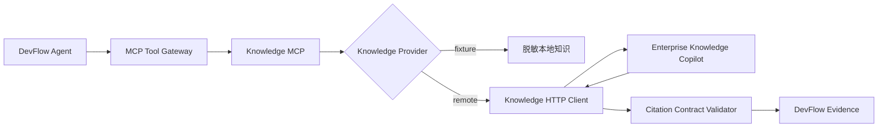

# DevFlow Agent × Enterprise Knowledge Copilot 远程接入指南

## 当前状态

DevFlow 已完成远程知识服务的客户端侧准备：

- `search_knowledge` 仍通过 Agent 主链的 Knowledge MCP 调用。
- Knowledge MCP 可在 `fixture` 与 `remote` 两种 Provider 间切换。
- Remote Provider 传递 Tenant、User、Groups、过滤条件和 Request ID。
- 远程响应经过严格 Pydantic Citation Contract 校验后才转换为 Evidence。
- 401、403、Tenant/Request ID 不匹配和非法 Citation 不使用本地数据掩盖。
- 超时、429、502、503、504 可有限重试，并可在本地演示环境降级到脱敏 Fixture。
- 远程 answer 没有任何有效 Citation 时会被丢弃。
- 检索文本只作为不可信证据，不能修改 Plan、权限或触发写操作。

当前默认仍为 `fixture`，因为另一台电脑的 API 地址与 Token 尚未提供。

## 架构边界



Knowledge Copilot 负责摄取、检索、Rerank、ACL 与 Citation；DevFlow 负责调用时机、查询构造、Evidence 转换、跨证据推理和受控行动。

## 本地配置

在 DevFlow 根目录 `.env` 填写：

```dotenv
DEVFLOW_KNOWLEDGE_MODE=remote
KNOWLEDGE_API_BASE=http://<另一台电脑局域网IP>:8100
KNOWLEDGE_API_TOKEN=<只在本地填写>
KNOWLEDGE_TIMEOUT_SECONDS=35
KNOWLEDGE_MAX_RETRIES=1
KNOWLEDGE_FIXTURE_FALLBACK=true
```

配置后重启 DevFlow Backend。Token 不得传入前端、任务状态、事件 Payload、日志或 Git。

## DevFlow 发出的请求

```http
POST /api/v1/retrieval/query
Authorization: Bearer <service-token>
X-Request-ID: task_xxx:S3
Content-Type: application/json
```

```json
{
  "query": "payment Redis 连接池异常 故障",
  "tenant_id": "demo-tenant",
  "user_id": "demo-user",
  "groups": ["developer", "git-writer"],
  "filters": {
    "service": "payment",
    "document_types": ["incident", "runbook"],
    "tags": []
  },
  "top_k": 5,
  "request_id": "task_xxx:S3"
}
```

## DevFlow 接受的响应

```json
{
  "query_id": "q_123",
  "answer": "历史案例摘要",
  "evidence": [
    {
      "document_id": "inc_2025_017",
      "chunk_id": "c_8",
      "title": "Redis 连接池耗尽复盘",
      "quote": "高峰期连接未及时释放导致连接池耗尽。",
      "source_uri": "knowledge://inc_2025_017#c_8",
      "score": 0.91,
      "document_type": "incident",
      "metadata": {
        "service": "payment",
        "heading": null,
        "page_start": null,
        "page_end": null,
        "updated_at": "2026-08-14",
        "tags": ["redis"],
        "untrusted_retrieved_content": true
      }
    }
  ],
  "retrieval_version": "2026-08-13",
  "tenant_id": "demo-tenant",
  "request_id": "task_xxx:S3",
  "latency_ms": 86,
  "latency": {
    "total_ms": 86,
    "retrieval_ms": 60,
    "reranker_ms": 20
  },
  "warnings": []
}
```

响应必须原样回传请求的 `tenant_id` 和 `request_id`。引用必须包含可定位的 `document_id`、`chunk_id` 与 `source_uri`；当前允许 `knowledge://`、`https://` 和 `http://` URI。每条 Citation 还必须带 `metadata.untrusted_retrieved_content=true`。

## Evidence 转换

| Knowledge Citation | DevFlow Evidence |
|---|---|
| `document_id#chunk_id` | `raw_ref` |
| `source_uri` | `source_uri` |
| `title + quote` | `summary` |
| 引用四元组哈希 | `content_hash` |
| `query_id + source_uri` 哈希 | 稳定 `evidence_id` |

## 降级规则

| 场景 | 重试 | Fixture 降级 | Agent 行为 |
|---|---:|---:|---|
| 超时、连接失败、429/502/503/504 | 有限 | 可配置 | 使用脱敏 Fixture 或标注知识缺失 |
| 401/403 | 否 | 禁止 | 不接受知识证据，记录降级原因 |
| Tenant/Request ID 不匹配 | 否 | 禁止 | 丢弃整个响应 |
| Citation Schema 非法 | 否 | 禁止 | 丢弃整个响应 |
| 空 Evidence 但有 Answer | 否 | 不需要 | 丢弃无引用 Answer |

`KNOWLEDGE_FIXTURE_FALLBACK=true` 仅适合本地演示。生产环境建议设为 `false`，明确暴露依赖不可用。

## 首次联调步骤

1. 在 Knowledge Copilot 电脑确认监听 `0.0.0.0:8100`。
2. 在 DevFlow 电脑执行 `Test-NetConnection <IP> -Port 8100`。
3. 验证 `GET http://<IP>:8100/health`。
4. 用脱敏 Token 手工调用一次检索接口，确认 Tenant、Request ID 和 Citation。
5. 填写 DevFlow `.env` 并切换为 `remote`。
6. 重启 Backend，检查 `/health` 的 `tools.knowledge`。
7. 提交标准 payment 调查任务，检查 S3 的 `provider=remote`、`query_id` 与 `retrieval_version`。
8. 验证报告包含真实 Knowledge Evidence URI。
9. 运行全量测试和 Golden Set。

## 验证命令

```powershell
python -m pytest
python evaluate.py
python verify_knowledge.py
```

客户端专项测试位于 `tests/test_knowledge_integration.py`，覆盖认证头和 ACL 上下文、503 重试、401/403 不重试、Tenant 错配、非法 Citation、无引用 Answer、Fixture 降级和恶意文档不改变审批策略。

## 等待对方项目提供

- 局域网 IP 和端口。
- `/health` 与 Swagger/OpenAPI 地址。
- Service Token 的本地配置方式。
- 稳定测试 Query。
- 测试 Tenant/User/Groups。
- 一条脱敏成功响应。
- 预期 document_id、chunk_id、source_uri。
- 对方完整自动化测试结果。

收到这些信息后，只需完成真实网络契约测试与联合 Golden Set，无需再次改造 Agent 主链。
